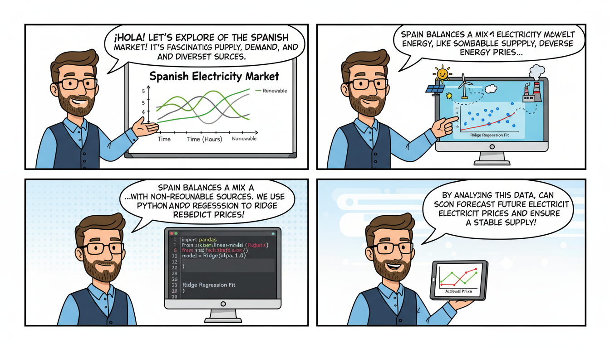

This is a comprehensive `README.md` file designed for your repository. It highlights the technical aspects of the project, the methodology used, and how to get started.

---

# ⚡ Data Analysis: Spanish Electricity Market

[](https://www.python.org/)
[](https://scikit-learn.org/)
[](https://opensource.org/licenses/MIT)

## 📌 Overview

This repository contains a detailed exploratory data analysis (EDA) and predictive modeling of the **Spanish Electricity Market**. The primary objective of this project is to understand the dynamics between various market variables—such as demand, generation types (renewable vs. non-renewable), and external factors—and their impact on electricity pricing.

The project utilizes **Ridge Regression (L2 Regularization)** to establish relationships among these variables, ensuring the model remains robust against multicollinearity, which is common in energy market datasets.

## 🚀 Features

- **Data Cleaning & Preprocessing:** Handling time-series data, missing values, and feature engineering.
- **Exploratory Data Analysis (EDA):** Visualizing price trends, demand curves, and the "duck curve" effect in the Spanish market.
- **Predictive Modeling:** Implementing Ridge Regression to quantify the weight of different energy sources on the final pool price.
- **Model Evaluation:** Using metrics such as R-squared, Mean Absolute Error (MAE), and Root Mean Squared Error (RMSE).

## 🛠️ Tech Stack

- **Language:** Python
- **Libraries:**
    - `pandas` & `numpy`: Data manipulation and numerical analysis.
    - `matplotlib` & `seaborn`: Statistical data visualization.
    - `scikit-learn`: Machine learning implementation (Ridge Regression, scaling, and splitting).
- **Environment:** Jupyter Notebook

## 📂 Project Structure

```text
├── README.md                 # Project documentation
├── electricity_market_sp.ipynb # Main analysis and modeling notebook
└── data/                     # (Optional) Folder for raw/processed datasets
```

## 📊 Methodology: Why Ridge Regression?

In the Spanish electricity market, variables like "Solar Generation" and "Temperature" or "Wind Generation" and "Price" are often highly correlated. Standard OLS (Ordinary Least Squares) regression can lead to overfitting or unstable coefficients in the presence of such **multicollinearity**.

**Ridge Regression** was chosen because:
1. It adds a penalty ($\alpha$) to the size of the coefficients.
2. It prevents any single variable from dominating the model unfairly.
3. It improves the model's ability to generalize to new market data.

## 💻 Usage Example

To run the analysis locally, ensure you have the dependencies installed:

```bash
pip install pandas numpy matplotlib seaborn scikit-learn
```

Below is a conceptual snippet of the Ridge implementation found in the notebook:

```python
from sklearn.linear_model import Ridge
from sklearn.model_selection import train_test_split
from sklearn.preprocessing import StandardScaler

# Loading features (e.g., Wind, Solar, Gas, Demand) and Target (Price)
X = df[['wind_gen', 'solar_gen', 'gas_price', 'demand']]
y = df['electricity_price']

# Standardizing is crucial for Ridge Regression
scaler = StandardScaler()
X_scaled = scaler.fit_transform(X)

# Split and Fit
X_train, X_test, y_train, y_test = train_test_split(X_scaled, y, test_size=0.2, random_state=42)
ridge_mod = Ridge(alpha=1.0)
ridge_mod.fit(X_train, y_train)

print(f"Model Score: {ridge_mod.score(X_test, y_test)}")
```

## 📈 Key Insights (Sample)

*   **Renewable Impact:** High wind and solar penetration show a significant negative correlation with market prices (the "merit-order effect").
*   **Demand Sensitivity:** Electricity demand remains a primary driver for price spikes during peak hours (8:00 PM - 10:00 PM).
*   **Regularization:** The Ridge penalty helped stabilize the coefficients for gas-related variables during periods of high volatility.

## 🤝 Contributing

Contributions are welcome! If you have suggestions for improving the model (e.g., trying Lasso or ElasticNet) or adding more recent data from ESIOS, please follow these steps:

1. Fork the Project.
2. Create your Feature Branch (`git checkout -b feature/AmazingFeature`).
3. Commit your Changes (`git commit -m 'Add some AmazingFeature'`).
4. Push to the Branch (`git push origin feature/AmazingFeature`).
5. Open a Pull Request.

## 📄 License

Distributed under the MIT License. See `LICENSE` for more information.

---
**Author:** [Your Name/GitHub Profile]
**Data Source:** (e.g., REE - Red Eléctrica de España / ESIOS API)